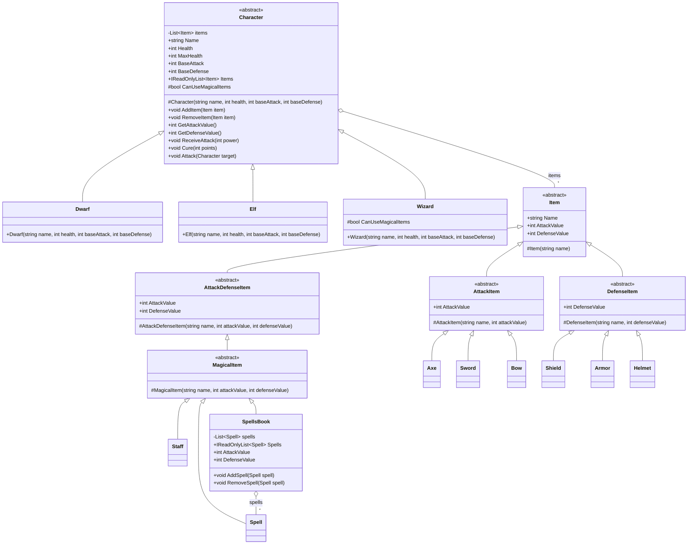

## Decisiones de diseño

- **Todo lo común está en `Character`**: vida, recibir ataques, curarse y tener
  elementos (`AddItem` / `RemoveItem`). El ataque y la defensa totales se
  calculan igual para todos los personajes: el valor base más lo que aporta
  cada elemento.
- **`Item` define `AttackValue` y `DefenseValue` como virtuales que devuelven 0.**
  Cada subclase sobrescribe solo lo que aporta: un arma solo ataque, un
  elemento de defensa solo defensa y `AttackDefenseItem` las dos cosas. Así
  `Character` suma los valores de sus elementos sin preguntar de qué tipo es
  cada uno (polimorfismo).
- **Solo los magos usan elementos mágicos.** `Character` rechaza cualquier
  `MagicalItem` salvo que `CanUseMagicalItems` sea verdadero, y solo `Wizard`
  lo sobrescribe. Los magos también pueden usar elementos comunes.
- **`SpellsBook` calcula su ataque y defensa sumando sus hechizos**, en vez de
  guardar un valor que haya que mantener sincronizado.
