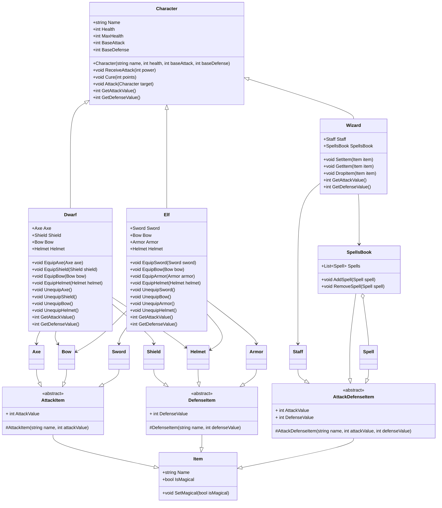

# Roleplay Game Diagram

```mermaid
classDiagram 

    class Character {
        +string Name
        +int Health
        +int MaxHealth
        +int BaseAttack
        +int BaseDefense
        +Character(string name, int health, int baseAttack, int baseDefense)
        +void ReceiveAttack(int power)
        +void Cure(int points)
        +void Attack(Character target)
        +int GetAttackValue()
        +int GetDefenseValue()
    }

    class Item {
        +string Name
        +bool IsMagical
        +void SetMagical(bool isMagical)
    }

    class Dwarf {
        +Axe Axe
        +Shield Shield
        +Bow Bow
        +Helmet Helmet
        +void EquipAxe(Axe axe)
        +void EquipShield(Shield shield)
        +void EquipBow(Bow bow)
        +void EquipHelmet(Helmet helmet)
        +void UnequipAxe()
        +void UnequipShield()
        +void UnequipBow()
        +void UnequipHelmet()
        +int GetAttackValue()
        +int GetDefenseValue()
    }

    class Elf {
        +Sword Sword
        +Bow Bow
        +Armor Armor
        +Helmet Helmet
        +void EquipSword(Sword sword)
        +void EquipBow(Bow bow)
        +void EquipArmor(Armor armor)
        +void EquipHelmet(Helmet helmet)
        +void UnequipSword()
        +void UnequipBow()
        +void UnequipArmor()
        +void UnequipHelmet()
        +int GetAttackValue()
        +int GetDefenseValue()
    }

    class Wizard {
        +Staff Staff
        +SpellsBook SpellsBook
        +void SetItem(Item item)
        +void GetItem(Item item)
        +void DropItem(Item item)
        +int GetAttackValue()
        +int GetDefenseValue()
    }

    class AttackItem {
        <<abstract>>
        + int AttackValue
        #AttackItem(string name, int attackValue)
    }

    class DefenseItem {
        <<abstract>>
        + int DefenseValue
        #DefenseItem(string name, int defenseValue)
    }

    class AttackDefenseItem {
        <<abstract>>
        + int AttackValue
        + int DefenseValue
        #AttackDefenseItem(string name, int attackValue, int defenseValue)
    }

    class Axe
    class Shield
    class Bow
    class Helmet
    class Sword
    class Armor
    class Staff
    class Spell

    class SpellsBook {
        +List~Spell~ Spells
        +void AddSpell(Spell spell)
        +void RemoveSpell(Spell spell)
    }

    Character <|-- Dwarf
    Character <|-- Elf
    Character <|-- Wizard

    AttackItem --|> Item
    DefenseItem --|> Item
    AttackDefenseItem --|> Item
    
    Axe --|> AttackItem
    Shield --|> DefenseItem
    Bow --|> AttackItem
    Helmet --|> DefenseItem
    Sword --|> AttackItem
    Armor --|> DefenseItem
    Staff --|> AttackDefenseItem
    SpellsBook --|> AttackDefenseItem
    Spell --|> AttackDefenseItem

    Dwarf --> Axe
    Dwarf --> Shield
    Dwarf --> Bow
    Dwarf --> Helmet

    Elf --> Sword
    Elf --> Bow
    Elf --> Armor
    Elf --> Helmet

    Wizard --> Staff
    Wizard --> SpellsBook
    SpellsBook o-- Spell
```